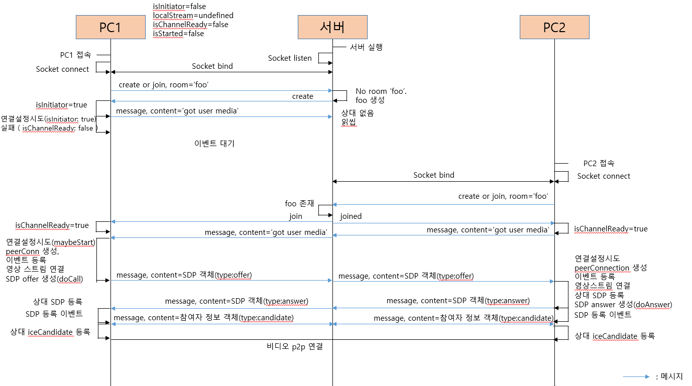

# 설치
```
npm i
```
# 실행
```
npx nodemon index
```

# 접속
https://localhost:8081
고급 => 페이지 접속하기 클릭

# 구현 기능
- 1:1 비디오 및 오디오 통신 (로컬 / 내부 네트워크)

# 구현 예정
- 1:N 통신
- 외부 네트워크 통신

# 문제점
- 아이폰으로 접속 시 통신 불가

# 시그널링 서버의 동작 과정

